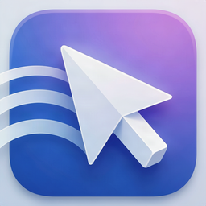

# BorderlessMouse

<p align="center"></p>

[](https://github.com/pkozubski/BorderlessMouse/actions/workflows/ci.yml)
[](https://github.com/pkozubski/BorderlessMouse/releases/latest)

Współdzielenie **klawiatury i myszy** oraz **dźwięku** między Windows a macOS po sieci
lokalnej – bez sterowników, bez chmury, z minimalnym opóźnieniem.

Scenariusz, na który jest zbudowana ta wersja:

* **Windows → Mac**: fizyczna klawiatura i mysz podpięte do Windowsa sterują Makiem
  (kursor przechodzi przez krawędź ekranu jak w Synergy/Barrier).
* **Mac → Windows**: cały dźwięk systemowy Maca gra na słuchawkach/głośnikach Windowsa.
* **Schowek w obie strony**: skopiowany tekst pojawia się w schowku drugiego komputera
  w ok. 0,5 s (bez przełączania kursora).
* **Autostart**: obie aplikacje mogą uruchamiać się przy logowaniu i czekać w tle
  (pasek menu / zasobnik).

```
┌──────────────── Windows ────────────────┐        ┌──────────────── macOS ─────────────────┐
│ hooki WH_MOUSE_LL / WH_KEYBOARD_LL      │  TCP   │ NWListener :47800                      │
│ → ramki protokołu → TcpClient (NODELAY) │ ─────▶ │ → CGEvent (mysz, klawiatura)           │
│                                         │        │                                        │
│ UDP :47802 → bufor jitter → WASAPI      │ ◀───── │ Core Audio process tap (14.2+) → UDP   │
│ (NAudio, shared/exclusive)              │  UDP   │ PCM 16-bit, ~5 ms na pakiet             │
│                                         │        │                                        │
│ broadcast "BLM1?" → lista Maców         │ ◀───── │ odpowiedź discovery :47801              │
│ schowek (GetClipboardSequenceNumber)    │ ◀────▶ │ schowek (NSPasteboard.changeCount)      │
└─────────────────────────────────────────┘        └────────────────────────────────────────┘
```

Szczegóły protokołu: [PROTOCOL.md](PROTOCOL.md).

## Wymagania

| | |
|---|---|
| macOS | 14.2 lub nowszy (Core Audio taps). Uprawnienia: **Dostępność** i **Nagrywanie dźwięku systemowego**. |
| Windows | Windows 10/11 x64. Plik `BorderlessMouse-Windows-x64.exe` z [Releases](https://github.com/pkozubski/BorderlessMouse/releases/latest) nie wymaga instalowania .NET. |
| Sieć | Obie maszyny w tej samej sieci LAN (najlepiej kabel; Wi‑Fi też działa). |

## Pobieranie

Gotowe pliki są w [GitHub Releases](https://github.com/pkozubski/BorderlessMouse/releases/latest):

* `BorderlessMouse-macOS.zip` – uniwersalna aplikacja (Apple Silicon + Intel). Rozpakuj i przenieś
  do `~/Applications` (auto-updater potrzebuje prawa zapisu do katalogu aplikacji).
* `BorderlessMouse-Windows-x64.exe` – pojedynczy plik, bez instalatora.
* `SHA256SUMS.txt` – sumy kontrolne używane też przez updater.

Wydania są podpisane ad-hoc (bez konta Apple Developer), więc przy pierwszym uruchomieniu na
Macu trzeba kliknąć aplikację prawym przyciskiem → **Otwórz**, a na Windowsie potwierdzić
ostrzeżenie SmartScreen.

## Autostart

Przełącznik **Uruchamiaj przy logowaniu** jest w karcie „Ustawienia” (macOS) i w grupie
„Uruchamianie” (Windows). Stan jest czytany z systemu, więc zgadza się z tym, co widać
w ustawieniach systemowych, nawet po ręcznej zmianie.

| | Mechanizm | Gdzie to widać |
|---|---|---|
| macOS | `SMAppService.mainApp` (element logowania). Gdy system go odrzuci, aplikacja instaluje LaunchAgent w `~/Library/LaunchAgents/com.borderlessmouse.mac.login.plist`. | Ustawienia systemowe → Ogólne → Elementy logowania |
| Windows | Wpis `BorderlessMouse` w `HKCU\Software\Microsoft\Windows\CurrentVersion\Run` (bez uprawnień administratora). | Menedżer zadań → Aplikacje autostartu |

Przy starcie z logowania aplikacja domyślnie nie otwiera okna: macOS pokazuje tylko ikonę
w pasku menu, Windows tylko ikonę w zasobniku (można to wyłączyć obok przełącznika
autostartu). Wpis autostartu jest automatycznie poprawiany, jeśli plik aplikacji zmieni
ścieżkę, np. po przeniesieniu folderu.

Diagnostyka: `BorderlessMouse.app/Contents/MacOS/BorderlessMouse --login-item-test` włącza
autostart, wypisuje użyty mechanizm i przywraca poprzedni stan.

## Interfejs

Obie aplikacje mają ten sam układ: nagłówek z logo i pastylką stanu, a pod nim karty
(połączenie, klawiatura i mysz, dźwięk, schowek, uruchamianie, ustawienia, aktualizacje,
dziennik) z wierszami „tytuł + opis + kontrolka”. Na Macu to SwiftUI, na Windowsie Avalonia
z motywem FluentAvalonia (kontrolki WinUI 3, Mica, systemowy kolor akcentu), więc karty są
wspólne, a przełączniki, listy i suwaki pochodzą z danego systemu.

Podgląd wyglądu bez uruchamiania sieci i uprawnień:

* macOS: `BorderlessMouse.app/Contents/MacOS/BorderlessMouse --ui-preview zrzut.png`
* Windows: `BorderlessMouse.exe --screenshot zrzut.png` (zapisuje też `zrzut-bottom.png`
  z dołem okna). W tym trybie aplikacja nie łączy się z niczym i pokazuje przykładowe dane.

## Auto-updater

Obie aplikacje sprawdzają najnowsze wydanie na GitHubie (5 s po starcie i co 6 godzin, można
wyłączyć w karcie **Aktualizacje**). Aktualizacja jest pobierana, weryfikowana sumą SHA-256 i
instalowana jednym kliknięciem, po czym aplikacja uruchamia się ponownie.

* **Windows**: nowy plik exe podmienia bieżący po zamknięciu aplikacji (skrypt `swap.cmd` w `%TEMP%`).
* **macOS**: bundle jest podmieniany w miejscu. Ponieważ wydania są podpisane ad-hoc, macOS po
  aktualizacji zapomina uprawnienie Dostępność. Rozwiązanie: w karcie **Aktualizacje →
  Zaawansowane** podaj nazwę własnego certyfikatu z pęku kluczy; updater podpisze nim pobraną
  wersję i uprawnienia zostaną (jak utworzyć certyfikat: sekcja *Budowanie → macOS*).

Nowe wydanie robi się jednym tagiem:

```bash
git tag v1.1.0 && git push --tags
```

Workflow `.github/workflows/release.yml` buduje obie aplikacje, liczy sumy i publikuje release.

## Uruchomienie krok po kroku

### 1. Mac

Zbudowana lokalnie aplikacja: `macos/build/BorderlessMouse.app` (po `./build.sh`).

1. Uruchom aplikację. Nasłuchuje na TCP 47800 i odpowiada na discovery (UDP 47801).
2. W karcie **Uprawnienia macOS** kliknij **Poproś** przy „Dostępność” i włącz
   BorderlessMouse w *Ustawienia systemowe → Prywatność i ochrona → Dostępność*.
3. Przy pierwszym streamie audio macOS zapyta o **nagrywanie dźwięku systemowego** – zgódź się
   (*Prywatność i ochrona → Nagrywanie ekranu i dźwięku systemowego*).
4. Na macOS 15+ może pojawić się pytanie o **Sieć lokalną** – również zgódź się.
5. Jeśli zapora macOS jest włączona, zezwól na połączenia przychodzące.

Aplikacja ma też ikonę w pasku menu z szybkimi przełącznikami.

### 2. Windows

1. Uruchom `BorderlessMouse.exe` (przy pierwszym starcie Zapora Windows zapyta o dostęp – zaznacz
   **Sieci prywatne**; bez tego nie dotrze dźwięk UDP).
2. Mac pojawi się na liście **Znalezione Maki** – kliknij go (albo wpisz IP) i **Połącz**.
3. Ustaw, po której stronie ekranu stoi Mac (domyślnie *po lewej*).
4. Przesuń mysz przez tę krawędź – kursor przechodzi na Maca, a kursor Windows zostaje
   (ukryty) w miejscu przekroczenia. Ruch myszy jest czytany przez Raw Input, więc nie ma
   akceleracji Windows; tempo dostroisz suwakiem „Czułość myszy na Macu”. Powrót: przesuń
   kursor przez przeciwną krawędź Maca albo naciśnij **Scroll Lock** (działa w obie strony).
5. Dźwięk: włączony domyślnie; wybierz urządzenie wyjściowe i ewentualnie zmniejsz bufor.
6. Schowek: włączony domyślnie po obu stronach (karta **Schowek**); synchronizowany jest
   tekst do 1 MB. Obrazy i pliki nie są przesyłane.

Ustawienia są zapisywane w `%APPDATA%\BorderlessMouse\settings.json`; zamknięcie okna chowa
aplikację do zasobnika (wyjście przez menu ikony).

## Opóźnienie i wydajność

* **Wejście**: TCP z `TCP_NODELAY`, ramki 4–7 bajtów, zero buforowania po stronie Maca
  (zdarzenia lecą prosto do `CGEvent.post`). RTT po LAN < 1 ms.
* **Audio**: brak kodeka (PCM 16-bit, 1,5 Mb/s przy 48 kHz stereo), pakiety co ~5 ms,
  bufor jitter domyślnie 20 ms, WASAPI shared 15 ms (exclusive: 5 ms). Realne opóźnienie
  end-to-end zwykle 30–45 ms. Na kablu można zejść z buforem do 5–10 ms.
* Mac przechwytuje dźwięk przez **Core Audio process tap** – bez BlackHole/Soundflower;
  opcja „Wycisz głośniki Maca” używa `muteBehavior = .mutedWhenTapped`, więc dźwięk słychać
  tylko na Windowsie.

## Mapowanie klawiszy

Klawisze mapowane są **po scancode** (pozycja fizyczna), więc układ klawiatury jest
niezależny od systemu. Domyślnie *Ctrl ↔ Cmd* są zamienione (Ctrl+C na PC = ⌘C na Macu),
można to wyłączyć na Macu. Win = ⌘, Alt = ⌥, PrintScreen = F13, Insert = Help,
klawisze multimedialne (głośność, play/pause, next/prev) działają.

## Budowanie

### macOS

```bash
cd macos
./build.sh                # swiftc, wystarczą Command Line Tools → build/BorderlessMouse.app
CONFIG=debug ./build.sh   # bez optymalizacji
# Xcode:
xcodegen generate         # brew install xcodegen
open BorderlessMouse.xcodeproj
```

Uwaga: build ad-hoc (`build.sh` bez `SIGN_IDENTITY`) zmienia sygnaturę przy każdej
kompilacji. macOS pokazuje wtedy aplikację jako włączoną w liście Dostępności, ale
`AXIsProcessTrusted` zwraca `false` i Mac natychmiast odsyła kursor do Windowsa.
Objaw po stronie Windows: w dzienniku „Mac natychmiast oddał sterowanie”.
Rozwiązania:

* usuń BorderlessMouse z listy *Dostępność* (minus) i dodaj ponownie po każdym buildzie, albo
* podpisuj stałym certyfikatem, wtedy uprawnienia zostają:
  * Xcode: wybierz swój Team w ustawieniach targetu, lub
  * bez konta developerskiego: w *Dostęp do pęku kluczy → Asystent certyfikatów → Utwórz
    certyfikat* (typ: *Podpisywanie kodu*, nazwa np. `BorderlessMouse Dev`), potem
    `SIGN_IDENTITY="BorderlessMouse Dev" ./build.sh`.

### Windows

```powershell
cd windows\BorderlessMouse
dotnet build -c Release                                  # wymaga .NET 8 SDK
dotnet publish -c Release -r win-x64 --self-contained true -p:PublishSingleFile=true -o ..\publish\win-x64
```

Projekt kompiluje się także na macOS/Linux (Avalonia); logika Windows (hooki, WASAPI)
jest oznaczona `[SupportedOSPlatform("windows")]`.

## Struktura

```
PROTOCOL.md                  – opis protokołu (TCP + UDP)
macos/
  build.sh                   – build bez Xcode
  project.yml                – XcodeGen
  BorderlessMouse/Sources/
    App/        Engine (logika), AppState (UI), Settings, ClipboardSync, Updater, LoginItem, UIPreview
    Network/    ControlServer (TCP), DiscoveryResponder (UDP), AudioSender (UDP)
    Input/      InputInjector (CGEvent), KeyMap (scancode → kVK)
    Audio/      SystemAudioTap (Core Audio process tap)
    Views/      ContentView (karty), Components (Card, SettingRow, StatusPill), pasek menu
assets/logo/                 – wspólne logo + skrypt generujący .icns/.ico/.png
.github/workflows/           – CI (build obu aplikacji) i Release (tag v* → GitHub Release)
windows/
  BorderlessMouse/
    Input/      NativeMethods, LowLevelHooks, NativeInputWindow (Raw Input + hider), InputCapture
    Models/     Settings, Autostart (klucz Run w rejestrze)
    Net/        ControlClient (TCP), Discovery (UDP), AudioReceiver (UDP), ClipboardSync, Updater
    Audio/      JitterBufferProvider, AudioPlayer (NAudio/WASAPI)
    Views/      MainWindow.axaml (karty w AppWindow z Mica), SettingRow
    ViewModels/ MainViewModel
```

## Użyte projekty open source

* [Avalonia UI](https://avaloniaui.net) (MIT) – interfejs Windows
* [FluentAvalonia](https://github.com/amwx/FluentAvalonia) (MIT) – style i kontrolki WinUI 3 (Fluent Design v2, Mica, kolor akcentu systemu)
* [NAudio](https://github.com/naudio/NAudio) (MIT) – WASAPI
* [CommunityToolkit.Mvvm](https://github.com/CommunityToolkit/dotnet) (MIT)
* Mechanika przełączania krawędzią i hooków wzorowana na Synergy/Barrier/Deskflow (GPL – kod nie jest kopiowany).

## Znane ograniczenia / co dalej

* Schowek synchronizuje tylko tekst (bez obrazów, plików i formatowania).
* Kierunek tylko Windows → Mac (wejście) i Mac → Windows (dźwięk); protokół jest gotowy na
  rozszerzenie o kierunek odwrotny.
* Caps Lock jest przekazywany jako zwykły klawisz – macOS może go ignorować.
* Audio bez szyfrowania i bez kompresji – zaprojektowane pod zaufaną sieć LAN.
